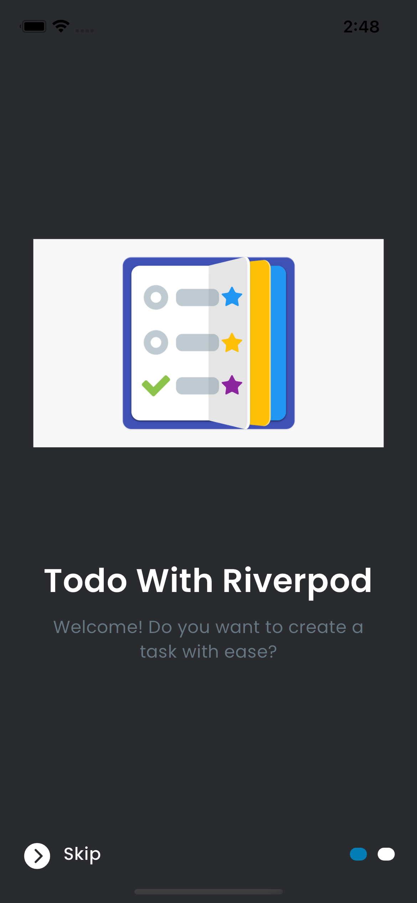
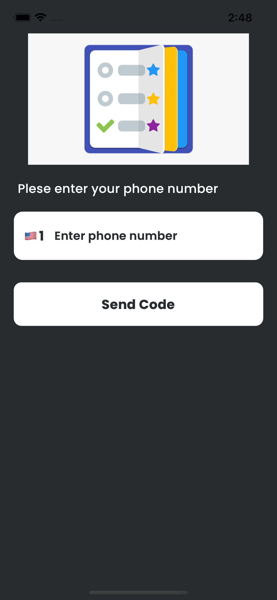
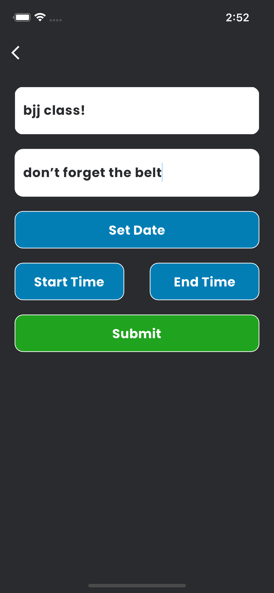
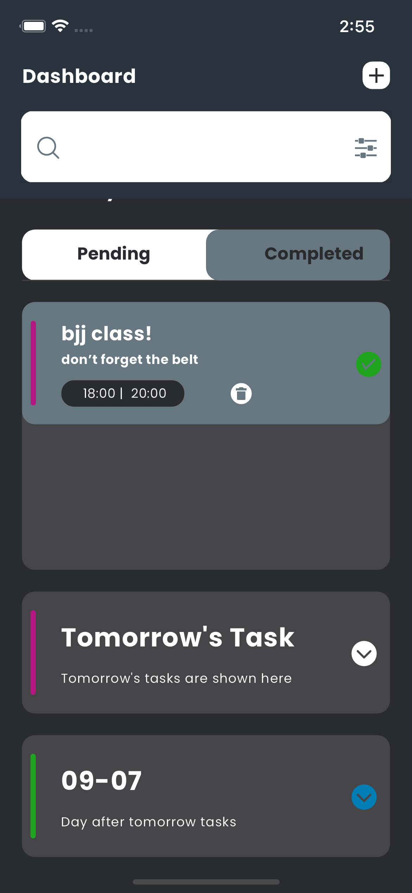
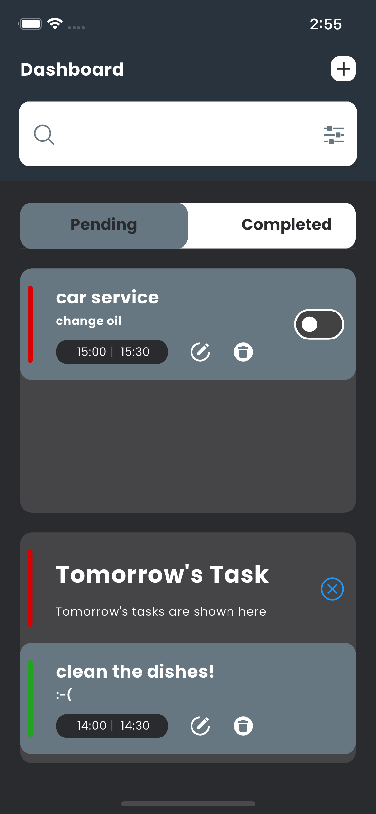

Todo With Riverpod 2.0

This Flutter Todo App serves as a testament to my skills as a developer, highlighting my expertise in Flutter, including state management using Riverpod and SQLite database management. Please note that this app is intended solely for technical demonstration and is not published on app stores.

Some of the main features of Todo With Riverpod App includes:

* Clean architecture for efficient code organization
* Implements secure SMS verification for user authentication.
* Streamlined state management with The Riverpod 2.0 Pattern
* Persisting the data with Sqlite
* Utilizes Flutter's local notification system to provide timely reminders for tasks

Some of the main features of Rick And Morty App includes:
* Clean architecture for efficient code organization
* Sign in with google or with an email/password
* Fetching Data from Api (with search functionality)
* Animations
* Streamlined state management with The Bloc Pattern
* Persisting the data with Hydrated BLoC

  
  
  
  
  

